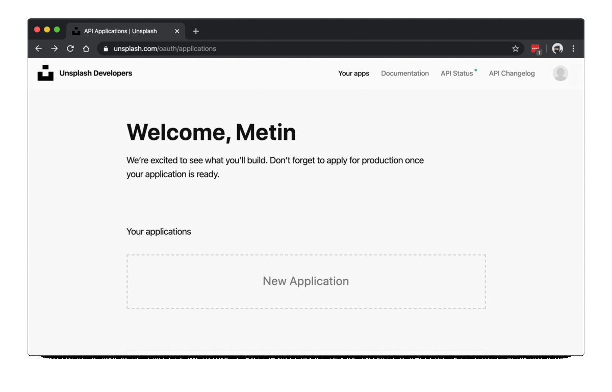

# assignment-1

Practice python skills.

## Description

We will do practices on following areas:

- python introduction
- exploratory data analysis
- parallel programming

For parallel programming, you have two tasks. We will download random images from [Unsplash](https://unsplash.com/), and create thumbnail images.

1. Download images from internet
2. Resize the images you download to thumbnails.

For comparison, we already implemented the serial process for both of these tasks. Once the notebook runs, we will be measuring processing time of the cell.

## Dataset

Random images meta information from [Unsplash](https://unsplash.com/). 

To download meta information of random images as JSON, use the following.

``` py
from data_prep import download_unsplash_json

# downloads to data/ json folder.
download_unsplash_json()
```

Get data into a list or dataframe.

``` py
from data_prep import get_images_df, get_images_list

# get as pandas dataframe.
get_images_df()

# get images as list of dictionaries.
get_images_list()
```

You can also create an images dataset by downloading images.

``` py
from data_prep import download_images

# downloads to data/ images folder.
download_images(quality='raw')
```

### Creating a Developer Account in Unsplash 

[Unsplash](https://unsplash.com/) is a website that shares freely awailable usable images. It is a nice website with all cool images from a lot of photographers. 

We will use this website to build our images dataset, using their [API](https://en.wikipedia.org/wiki/Application_programming_interface). You need to go to [Unsplash Developers](https://unsplash.com/developers), register, and create an application. Then you need to get an **access key** and **secret key**.

Below GIF shows how I created my developer account.



## How to work on this Assignment?

1. Download this repository with `git clone https://github.com/spu-bigdataanalytics-211/assignment-1.git`.
2. [Create a virtual environment](#how-to-create-a-new-virtual-environment) and activate this environment everytime you need to use it.
3. Install [requirements.txt](requirements.txt) file using `pip install -r requirements.txt`.
4. Run the notebook.

## Questions

The repository should be self descriptive and it should guide you through assignment. Let me know if you have any questions.
